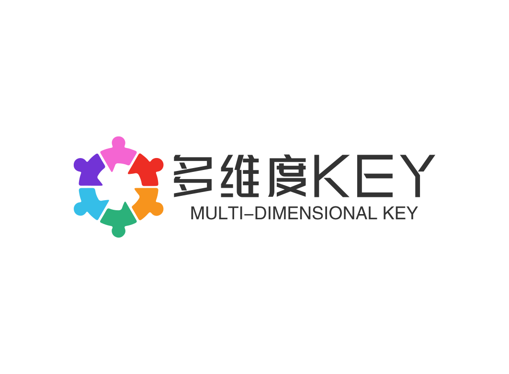
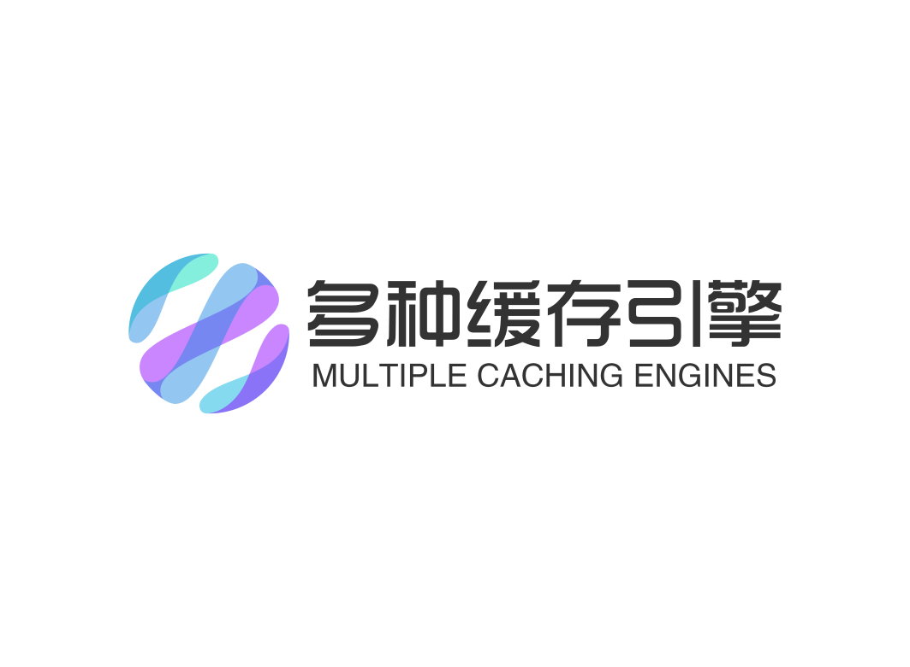
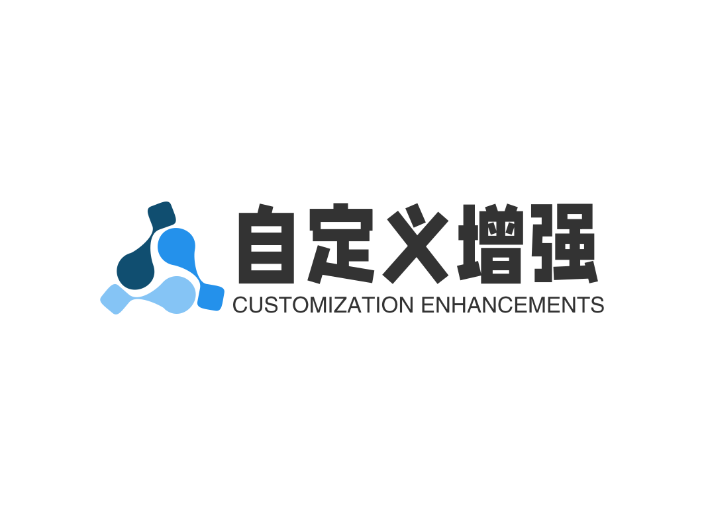

# EasyCache 框架

## 简介

​	EasyCache简易缓存框架，注解风格解决绝大部分缓存需求，支持接入Spring，一般项目等，拥有高度阶段性定制功能，快来使用吧，Gitee点赞！

​	虽然EasyCache刚刚发布，但在它未诞生之前，EasyCache就有了一个相对稳定的雏形，在我开发毕业设计的同时EasyCacheV0.0.0版本就开始着手构建，经过简单的测试发现可用性很强，自此缓存化变得更为简单可靠。

## 自动代理

​	无需修改代码逻辑结构，基于代理缓存实现，仅需在原有方法添加EasyCache相关注解即可~

## 多维度Key

​	基于**【模块】**， **【方法】**，**【参数】**三个维度设计缓存Key，保证缓存数据同步，方便管理。

​	对于微服务而言，组成缓存Key的【模块】部分显得尤为重要，在二级缓存中支撑了本地+远程同步，其次方法名和方法参数配合模块共同组建了缓存Key。

## 多引擎适配存储

​	提供**【内置】**， **【Redis】**，**【二级缓存】**三种缓存引擎选择，同时支持自定义缓存引擎，便捷开发。

​	EasyCache提供了Inner，Redis，Level2三种引擎其中Inner引擎作为默认引擎，Level2基于多引擎引擎实现本地＋远程缓存。

## 自定义增强

​	EasyCache拥有一套独立的**自定义增强处理器**，可以为每个方法实现个性化增强，系统自带了一套随机缓存时长，缓存异常转换处理器，在缓存增强的同时实现了代码健壮性增强。

​	在缓存增强的同时，EasyCache还能以方法级别指定个性化增强组件，在组件中即可阻断Key或是进行修改等操作，具有强大的扩展性。

> 猪皮恶霸
