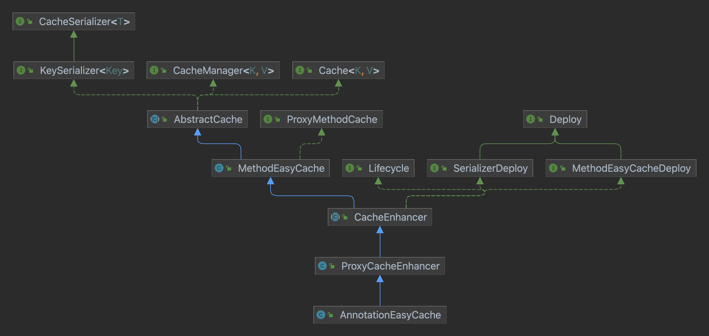
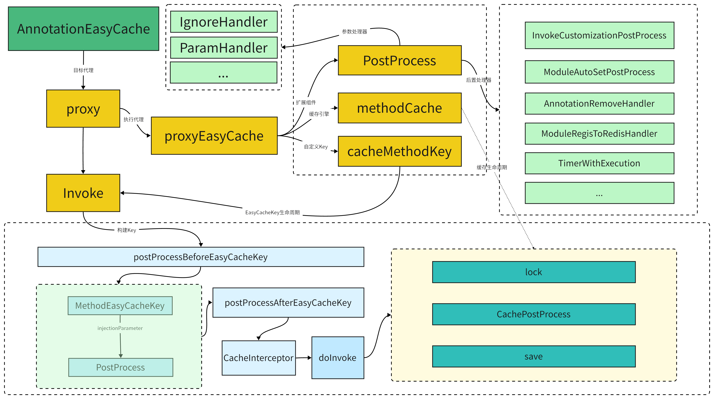

## 缓存架构

EasyCache的架构思想来源于Spring的扩展思想，优秀的开源框架Spring从Bean对象的各个生命周期入手，设计了很多后置处理器从而作为Spring的扩展点，而EasyCache的核心则是以缓存流程作为生命周期，配合各种后置处理器完成增强。

### 工程架构构介绍

EasyCache从上到下分为两部分组成

1. 缓存层：包含了缓存流程中的重要步骤（例如序列化、缓存管理）以及一些通用的缓存实现流程（例如缓存获取流程和存储流程）
2. 扩展层：扩展服务于缓存层面，在缓存的各个流程中实现打断，循环增强等功能

### 缓存流程

缓存增强是一个较复杂的代理模块，这里包含了缓存Key的构建、参数注入、原始方法调用、注解处理器增强等组件交互。

参见：

## 基础模型

内部全部处理器基于PostPrecess接口实现，具体分为InvokePostProcess和CachePostProcess两个部分进行细化处理。

InvokePostProcess主要发生在Invoke之前，其包含了一个子处理器（专注于EasyCacheKey的增强作用）。

CachePostProcess主要发生在Invoke之后（即调用结束），在此部分处理的任务可交给线程池进行操作，因为后置处理对业务逻辑并没有太多关联性。

## Invoke处理器

处理器包括了 after - pre - {} - before三个阶段，由after进行初始操作，pre作为中间操作直接控制着增强目标的执行权，before则进行执行操作后的善后处理，在EasyCache中的大多数处理器都基于这样的模型。

### AnnotationCacheCustomizationPostProcess

缓存后置处理器注册模块，子处理器且必须存在
否则CacheHandler注解将无法生效，即自定性处理器无法加载至当前缓存流程

作用：基于核心处理器实现的子处理器，可解析CacheHandler注解，对前者进行实例话并存储，当执行方法被授予了指定的处理器则会通过该处理器进行具体实现。

### AnnotationCacheMethodInvokeCustomizationPostProcess

执行后置处理器注册模块，子处理器且必须存在
否则InvokeHandler注解将无法生效，即自定性处理器无法加载至当前缓存流程

作用：基于核心处理器实现的子处理器，可解析InvokeHandler注解，对前者进行实例话并存储，当执行方法被授予了指定的处理器则会通过该处理器进行具体实现。

### AnnotationExpireAutoSetPostProcess

> 核心处理器，解析Expire的后置处理器 和EasyCache注解 EasyCache注解优先级最低

为了让核心处理器功能不太单调，其还支持Expire注解的解析

### AnnotationModuleAutoSetPostProcess

核心处理器，模块命名服务，确保缓存流程具备以模块隔离的功能，该模块必须存在，否则Module注解和MethodName注解将无法生效

### AnnotationParamFiledPostProcess

首个核心子处理器，是构成Key参数部分的利器，解析Param注解

### AnnotationRemoveHandler

核心处理器，这是一个极为重要的组件，是缓存一致性协议的必要存在，其控制着Remove注解的核心功能，使用该注解能够异步删除缓存中的数据

注：虽然异步删除缓存对目标方法的性能影响很小，但会在查询中存在一定的延迟！

### AnnotationInvokeExceptionHandler

核心子处理器，是EasyCache扩展服务中较为重要的处理器，可解析InvokeException注解，对前者进行实例话并存储，当执行方法被授予了指定的处理器则会通过该处理器进行异常捕获处理。

## 注解

对AnnotationEasyCache而言，所有存在以下注解的方法都会自动进行增强（除返回值为void的方法）

### @EasyCache

核心注解，所有参数都设有默认值，对于方法参数较少的方法可以直接使用。

- module：模块名
- methodName：方法名
- expire：过期时间策略
- exception：异常策略
- removes：关联删除缓存
- params：方法参数
- cache：是否缓存
- context：局部上下文

### @Module

- value：默认值"ky-cache"

### @MethodName

- value：默认值当前方法

### @Remove

- module：删除缓存所在模块名
- methodName：删除缓存所在方法名
- params：关联参数

### @Param

- name：参数名称
- value：参数值（常量）
- ref：引用参数值（引用当前方法中的某个参数，可以用.获取复杂对象的具体属性）
- type：参数值类型

### @Ignore

忽略参数不加入缓存Key的构建

### @InvokeHandler

- value：执行处理器

### @CacheHandler

- value：缓存处理器

### @InvokeException

- filter：异常过滤器
- result：结果转换器

### @Context

- type：CTX静态类
- func：方法名
- name：上下文参数名设定

